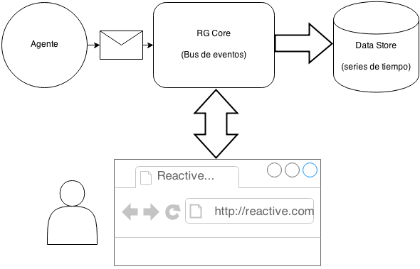

## Torus

**Torus** es el **"bus de eventos"** de ReactiveGrid. Es el sistema devorador de mensajes que funciona como columna vertebral de una instalación de ReactiveGrid.

El nombre del proyecto está dado por el toro topológico.

Además, rosquillas.

## Instalación (desarrollo)

### Dependencias

+ [Oracle VM VirtualBox](https://www.virtualbox.org)
+ [Vagrant](http://www.vagrantup.com)

>

1. Clona este repositorio

        $ git clone https://github.com/danioso/torus.git

2. Posiciónate en el directorio *setup*

        $ cd torus/setup

3. Arranca la máquina virtual

    **Este paso puede tardar varios minutos**. Es buena idea que vayas a tomar un café o que juegues una partida de 2048

        $ vagrant up

4. Conéctate a la máquina virtual vía ssh

        $ vagrant ssh

5. Lanza un *cluster* pseudo distribuido de Apache Cassandra

    Este script asigna 3 nodos y crea el *KEYSPACE* **reactivegrid_ks** y la tabla **metric**

        (guest) $ bash /vagrant/launch-cassandra-cluster.sh

6. Ejecuta el servidor de mensajes (RG Core), con el *KEYSPACE* **reactivegrid_ks** y una breve lista de nodos disponibles

        (guest) $ coffee server-example/server.coffee \
        reactivegrid_ks 127.0.0.1 127.0.0.2 127.0.0.3

7. Prueba la conexión con un cliente externo

        $ sudo npm install zmq async
        $ coffee client-example/client.coffee

8. Verifica que se hayan escrito 1000 eventos:

        (guest) $ ccm node1 cqlsh
        cqlsh> use reactivegrid_ks;
        cqlsh:reactivegrid_ks> select * from metric;
